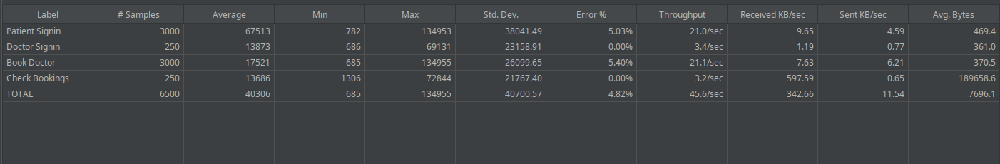
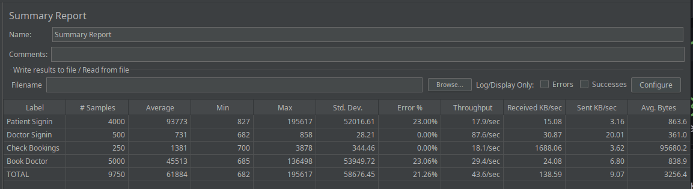
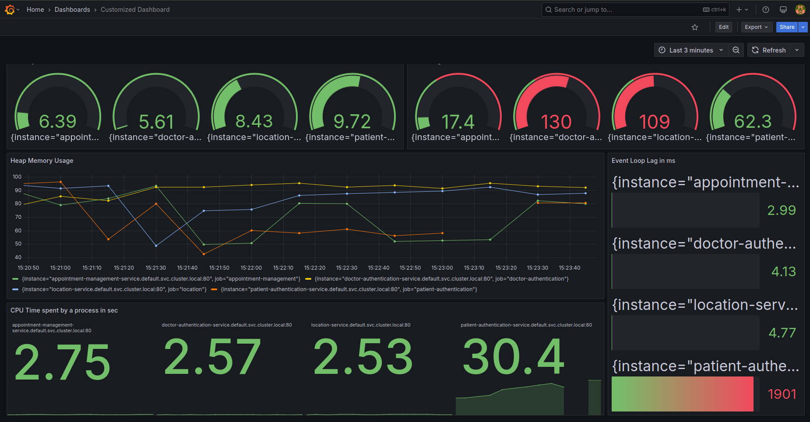

# DoctorHunt Application

## Overview

DoctorHunt is a scalable, microservices-based web application that connects patients with doctors. Patients can search for doctors by location, specialization, and availability, and book appointments online. Doctors can manage their availability and view their scheduled bookings. The application is deployed using Docker and Kubernetes, with monitoring and observability provided by Prometheus and Grafana.

**Access URLs:**
- **Web Application:** [http://34.68.91.168/](http://34.68.91.168/)
- **Prometheus Targets:** [http://34.57.12.7:9090/targets](http://34.57.12.7:9090/targets)
- **Grafana Login:** [http://34.59.241.143/login](http://34.59.241.143/login)

---

## Frontend Architecture and Deployment

The frontend is a React.js application served using **Nginx** for optimal performance. Nginx serves the static build files and acts as a reverse proxy, separating static file serving from backend API logic.

**User Flow:**
- **Patients:** Can sign up, log in, search for doctors by locality, type, and date, view available doctors, book appointments, and log out.
- **Doctors:** Can log in (using credentials provided by the admin), add their availability, or check bookings for their Doctor ID.

**Frontend Deployment Steps:**
1. Build the React app:
    ```bash
    npm run build
    ```
2. Use a Dockerfile to copy the build output and serve it with Nginx.
3. Build and push the Docker image:
    ```bash
    docker build -t gcr.io/YOUR_PROJECT_ID/frontend:latest .
    docker push gcr.io/YOUR_PROJECT_ID/frontend:latest
    ```
4. Deploy to Kubernetes using the provided deployment and service YAMLs:
    ```bash
    kubectl apply -f frontend/frontend-deployment.yaml
    kubectl apply -f frontend/frontend-service.yaml
    ```

---

## Backend Microservices Architecture and Deployment

The backend consists of **four major microservices** and a MySQL database with multiple tables:

### Databases/Tables:
- **patients:** Manages patient signup and login.
- **doctor_login:** Manages doctor login and stores doctor details.
- **doctor_availability:** Stores doctor availability entries.
- **location_map:** Stores distance maps for locations.
- **patient_details:** Stores patient bookings, mapped to doctor IDs.

### Microservices:

1. **Patient Authentication Microservice**
   - Handles patient signup and login.
   - Connects to the `patients` table.

2. **Doctor Authentication Microservice**
   - Handles doctor login.
   - Connects to the `doctor_login` table.

3. **Appointment Management Microservice**
   - Handles doctor availability entry and booking checks.
   - Connects to `doctor_availability` and `patient_details` tables.

4. **Location Microservice**
   - Handles doctor search and booking logic.
   - Connects to `location_map`, `doctor_login`, `doctor_availability`, and `patient_details`.

**Backend Deployment Steps:**
1. Each microservice has its own Dockerfile. Build and push images:
    ```bash
    docker build -t gcr.io/YOUR_PROJECT_ID/patient-authentication:latest ./backend/PatientAuthenticationMicroservice
    docker build -t gcr.io/YOUR_PROJECT_ID/doctor-authentication:latest ./backend/DoctorAuthenticationMicroservice
    docker build -t gcr.io/YOUR_PROJECT_ID/appointment-management:latest ./backend/AppointmentManagementMicroservice
    docker build -t gcr.io/YOUR_PROJECT_ID/location:latest ./backend/LocationMicroservice

    docker push gcr.io/YOUR_PROJECT_ID/patient-authentication:latest
    docker push gcr.io/YOUR_PROJECT_ID/doctor-authentication:latest
    docker push gcr.io/YOUR_PROJECT_ID/appointment-management:latest
    docker push gcr.io/YOUR_PROJECT_ID/location:latest
    ```
2. Deploy each microservice to Kubernetes:
    ```bash
    kubectl apply -f kubernetes/patient-authentication-deployment.yaml
    kubectl apply -f kubernetes/patient-authentication-service.yaml
    kubectl apply -f kubernetes/doctor-authentication-deployment.yaml
    kubectl apply -f kubernetes/doctor-authentication-service.yaml
    kubectl apply -f kubernetes/appointment-management-deployment.yaml
    kubectl apply -f kubernetes/appointment-management-service.yaml
    kubectl apply -f kubernetes/location-deployment.yaml
    kubectl apply -f kubernetes/location-service.yaml
    ```
3. Each service is exposed as a LoadBalancer for external access.

---

## Database and Persistent Storage

- MySQL is deployed as a single pod with a Persistent Volume (PV) and Persistent Volume Claim (PVC) for data durability.
- The PV is configured with `ReadWriteOnce` to ensure data consistency.

**Deployment Example:**
```bash
kubectl apply -f kubernetes/mysql-deployment.yaml
kubectl apply -f kubernetes/mysql-service.yaml
kubectl apply -f kubernetes/mysql-pv.yaml
kubectl apply -f kubernetes/mysql-pvc.yaml
```

---

## Monitoring and Observability

### Prometheus

- All backend microservices expose a `/metrics` endpoint using the `prom-client` library.
- Prometheus is deployed in the cluster and configured to scrape metrics from each microservice using Kubernetes service discovery.

**Prometheus Deployment:**
```bash
kubectl apply -f kubernetes/prometheus-configmap.yaml
kubectl apply -f kubernetes/prometheus-deployment.yaml
kubectl apply -f kubernetes/prometheus-service.yaml
```

**Scraping Metrics:**
- Prometheus automatically scrapes metrics from all services annotated with `prometheus.io/scrape: 'true'`.
- To manually check metrics for a service:
    ```
    curl http://<SERVICE_EXTERNAL_IP>/metrics
    ```

### Grafana

- Grafana is deployed for dashboard visualization.
- Connect Grafana to Prometheus as a data source and use PromQL queries to visualize metrics like CPU usage, event loop lag, etc.

**Grafana Deployment:**
```bash
kubectl apply -f kubernetes/grafana-deployment.yaml
kubectl apply -f kubernetes/grafana-service.yaml
```

---

## Horizontal Pod Autoscaling

- All microservices are configured with Horizontal Pod Autoscalers (HPA) to scale between 2 and 10 pods based on CPU utilization (threshold: 50%).

**Example HPA Deployment:**
```bash
kubectl apply -f kubernetes/patient-authentication-hpa.yaml
kubectl apply -f kubernetes/doctor-authentication-hpa.yaml
kubectl apply -f kubernetes/appointment-management-hpa.yaml
kubectl apply -f kubernetes/location-hpa.yaml
```

---

## Load Testing with JMeter

- Apache JMeter is used to simulate load and test system scalability.
- Configure JMeter to target the external IPs of the microservices.
- Example: To test the Patient Authentication Microservice, set up a POST request to `/api/patients/login` with appropriate payload.

---

## Load Testing Results and Analysis

Load tests were conducted using JMeter to evaluate the application's performance under different user loads. Monitoring was done using Grafana dashboards connected to Prometheus.

### Test 1: 2000 Concurrent Users (HPA Disabled)

**JMeter Summary Report:**


**Grafana Dashboard:**


**Analysis:**
- Without HPA, each microservice ran on a single pod.
- The JMeter report shows moderate average response times and throughput. The `BookDoctor` endpoint shows a significant error rate (19.90%), indicating potential bottlenecks.
- Grafana metrics show high memory usage across all services (above 92%) and varied CPU usage. The `appointment-management-service` and `patient-authentication-service` show higher CPU load compared to others. System Load Average is also elevated for these services.
- The high memory usage and errors suggest that the single pods were struggling to handle the load, likely hitting resource limits.

### Test 2: 6500 Concurrent Users (HPA Enabled)

**JMeter Summary Report:**


**Grafana Dashboard:**


**Analysis:**
- With HPA enabled (min 2, max 10 pods, 50% CPU threshold), the system handled a significantly higher load (6500 users).
- JMeter results show increased average response times and standard deviation, which is expected under higher load. However, the overall error rate decreased significantly (from 9.95% total to 4.82% total), especially for `BookDoctor` (19.90% down to 5.40%). Throughput also increased.
- Grafana shows that HPA scaled the pods as needed. While memory usage remained high (indicating potential memory leaks or inefficient memory management), CPU usage per pod was generally kept lower due to scaling, preventing CPU from becoming the primary bottleneck for most services. The `patient-authentication-service` still shows relatively high CPU usage.
- The significant database interaction (especially for booking and checking availability/locations) and high memory usage suggest the application is more **I/O-bound and memory-intensive** rather than purely CPU-bound. The database operations and inter-service communication likely contribute significantly to response times. HPA helped mitigate resource exhaustion on individual pods, improving reliability and throughput, but underlying I/O or memory constraints might limit further scalability without optimization.

### Test 3: 10000 Concurrent Users (HPA Enabled)

**JMeter Summary Report:**


**Grafana Dashboard:**


**Analysis:**
- Pushing the load further to 10000 concurrent users with HPA enabled tested the system's upper limits with the current configuration.
- The JMeter report shows a substantial increase in average response times and standard deviation compared to the 6500 user test. The overall error rate increased significantly to 21.26%, with `Patient Signin` and `Book Doctor` showing high error percentages (23.00% each). This indicates that the system struggled to cope with this level of load, likely hitting bottlenecks. Throughput increased compared to the 2000 user test but was comparable to the 6500 user test, suggesting saturation.
- Grafana metrics likely show that HPA scaled most microservices towards or at the maximum configured limit (10 pods). Despite scaling, high CPU usage is observed, particularly for `patient-authentication-service` (30.4 sec/process). Memory usage remains very high across all services. Event Loop Lag increased notably for `patient-authentication-service` (1901 ms), indicating severe processing delays.
- The high error rates, increased latency, and high resource utilization (CPU, Memory, Event Loop Lag) suggest that even with HPA, the system is overwhelmed at 10000 users. Bottlenecks likely exist in database performance, inter-service communication latency, or potentially within the services themselves (e.g., inefficient code paths, memory leaks exacerbated by load). The `patient-authentication-service` appears particularly stressed.

**Comparison Across Tests:**
- **2000 Users (No HPA):** System stressed, high memory, moderate errors, single pods overloaded.
- **6500 Users (HPA Enabled):** HPA effectively mitigated CPU bottlenecks by scaling pods, leading to lower error rates and higher throughput compared to the 2000 user test, despite increased latency. Memory usage remained a concern.
- **10000 Users (HPA Enabled):** HPA scaled pods to maximum, but the system reached saturation. High error rates, significantly increased latency, and high resource contention (CPU, Memory, Event Loop Lag) indicate that scaling alone is insufficient. Underlying bottlenecks (likely I/O, database, or service logic) limit performance at this scale. Further optimization or resource upgrades (e.g., database, node sizes) would be necessary to handle this load reliably.

---

## Example Commands

### Deploy Prometheus Pod
```bash
kubectl apply -f kubernetes/prometheus-deployment.yaml
kubectl apply -f kubernetes/prometheus-service.yaml
```

### Scrape Metrics from Prometheus
- Access Prometheus UI at `http://<PROMETHEUS_EXTERNAL_IP>:9090`
- Or, query metrics directly:
    ```bash
    curl http://<PROMETHEUS_EXTERNAL_IP>:9090/api/v1/query?query=up
    ```

---

## Summary

- **Frontend:** React.js served by Nginx, deployed as a Docker container and managed by Kubernetes.
- **Backend:** Four Node.js microservices, each with its own Docker image and Kubernetes deployment.
- **Database:** MySQL with persistent storage.
- **Monitoring:** Prometheus scrapes metrics from all microservices; Grafana visualizes metrics.
- **Scaling:** HPAs ensure microservices scale based on demand.
- **Testing:** JMeter used for load and stress testing.

For more details, refer to the architecture diagrams and the `kubernetes/` directory for deployment manifests.
